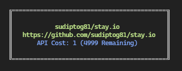

# awesome-cli

A CLI written in TypeScript to fetch details for a GitHub repository and print it to the console.



## Installation

```bash
npm install --global @sudiptog81/awesome-cli
# yarn global add @sudiptog81/awesome-cli
# npx @sudiptog81/awesome-cli
```

## Usage

```bash
$ awesome-cli

Usage: -r <repo>

Options:
      --help     Show help            [boolean]
      --version  Show version number  [boolean]
  -r, --repo     repository           [string] [required]
```

```bash
$ awesome-cli -r sudiptog81/awesome-cli

   ╔═══════════════════════════════════════════╗
   ║                                           ║
   ║            sudiptog81/stay.io             ║
   ║   https://github.com/sudiptog81/stay.io   ║
   ║       API Cost: 1 (4996 Remaining)        ║
   ║                                           ║
   ╚═══════════════════════════════════════════╝
```
